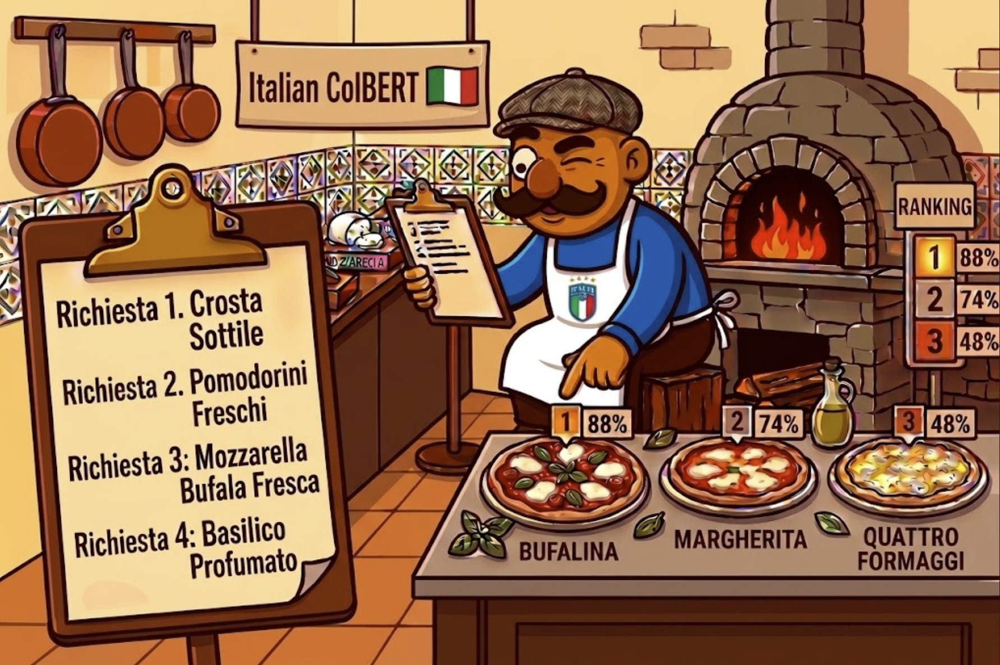

---
language:
- it
library_name: pylate
tags:
- colbert
- late-interaction
- sentence-transformers
- italian
- retrieval
- information-retrieval
- rag
- multi-vector
pipeline_tag: sentence-similarity
license: apache-2.0
base_model: nickprock/Italian-ModernBERT-base-embed-mmarco-mnrl
---

# ItColBERT



**A monolingual Italian late-interaction retriever.** Built with
[PyLate](https://github.com/lightonai/pylate) on top of an Italian ModernBERT
backbone, for semantic search and RAG over Italian text.

*Built and maintained by Enrico Nello. Training code, evaluation harness, and
full development history: [github.com/enricollen/it-colbert](https://github.com/enricollen/it-colbert).*

## TL;DR

- **What:** ColBERT-style multi-vector retriever, specialized on Italian.
- **Why it exists:** as far as I could find, there was no *Italian-only*
  late-interaction retriever — see "Why I built this" below.
- **Size:** ModernBERT-base backbone (~135M parameters), 128-dim token vectors —
  the smallest model in the comparison table below, by a wide margin.
- **Best at:** short-to-medium Italian passages (search, RAG chunks, FAQ
  retrieval). Weakest at long documents unless you use the chunking recipe
  below.
- **Not:** multilingual, and not the strongest late-interaction model overall
  — see [How it compares](#how-it-compares).

## Why I built this

Before starting, I looked for an Italian late-interaction model and mostly
found two things: multilingual late-interaction models that *include* Italian
among many languages ([`jina-colbert-v2`](https://huggingface.co/jinaai/jina-colbert-v2),
[`mLateOn`](https://huggingface.co/lightonai/mLateOn), [`ColBERT-XM`](https://huggingface.co/antoinelouis/colbertxm),
[`SauerkrautLM-Multi-ModernColBERT`](https://huggingface.co/VAGOsolutions/SauerkrautLM-Multi-ModernColBERT)),
and strong Italian dense embedding models that give up ColBERT's token-level
matching for a single vector per passage. Nothing I found combined the two:
an Italian-specialized model that keeps late interaction. That gap is what
made me want to try building one — not "the first Italian ColBERT" (it
isn't, the models above already cover Italian), but the first one that's
*specialized* on it rather than one language among many.

## What is late interaction, in plain terms?

Most retrieval embedding models compress a whole passage into a single
vector, so a search is one comparison per document. ColBERT-style models
instead keep one small vector **per token**, and score a document by finding
the best-matching document token for every query token (MaxSim), summing the
result. That keeps fine-grained lexical detail — rare names, specific
numbers, exact phrasing — that gets blurred away when everything is squeezed
into one vector. It costs more storage (many vectors instead of one) in
exchange for that precision.

## What this is for

- Building a RAG retrieval stage over Italian documents.
- Semantic search over Italian text where exact wording/entities matter, not
  just topic similarity.
- Reranking a first-stage retriever's candidates.

**Not** intended for: cross-lingual retrieval (query in one language,
documents in another — this model wasn't trained for it), or as a drop-in
replacement for large multilingual dense embedders when Italian isn't the
only language in your corpus.

## Quickstart

```bash
pip install -U pylate
```

### Reranking a short candidate list

The simplest usage — no index needed, good for reranking a first-stage
retriever's top results:

```python
from pylate import rank, models

model = models.ColBERT(model_name_or_path="enricollen/ItColBERT")

queries = ["Qual è la capitale d'Italia?"]
documents = [[
    "Roma è la capitale d'Italia.",
    "Milano è la capitale economica del Paese.",
    "Napoli è una città del sud Italia.",
]]
documents_ids = [[1, 2, 3]]

queries_embeddings = model.encode(queries, is_query=True)
documents_embeddings = model.encode(documents, is_query=False)

reranked = rank.rerank(
    documents_ids=documents_ids,
    queries_embeddings=queries_embeddings,
    documents_embeddings=documents_embeddings,
)
print(reranked)
# [[{'id': 1, 'score': 31.682}, {'id': 2, 'score': 31.552}, {'id': 3, 'score': 31.454}]]
# one list per query, sorted highest score first — "Roma" wins, as expected.
```

### Indexing a larger corpus

For anything beyond a handful of documents per query, build a persistent
index instead of reranking in memory every time:

```python
from pylate import indexes, models, retrieve

model = models.ColBERT(model_name_or_path="enricollen/ItColBERT")

index = indexes.PLAID(
    index_folder="pylate-index",
    index_name="index",
    override=True,
)

documents_ids = ["1", "2", "3"]
documents = ["document 1 text", "document 2 text", "document 3 text"]

documents_embeddings = model.encode(
    documents, batch_size=32, is_query=False, show_progress_bar=True,
)
index.add_documents(documents_ids=documents_ids, documents_embeddings=documents_embeddings)

retriever = retrieve.ColBERT(index=index)
queries_embeddings = model.encode(
    ["a query"], batch_size=32, is_query=True, show_progress_bar=True,
)
results = retriever.retrieve(queries_embeddings=queries_embeddings, k=10)
print(results)
# [[{'id': '1', 'score': 30.81}, {'id': '2', 'score': 30.80}, {'id': '3', 'score': 30.78}]]
# same shape as reranking above — list per query, sorted by score — but drawn
# from a persistent index instead of the in-memory documents you pass in.
```

Reload an existing index later without re-encoding anything:

```python
index = indexes.PLAID(index_folder="pylate-index", index_name="index")
```

**Documents longer than 512 tokens are truncated at index time.** If your
corpus has long documents (articles, reports, legal text), split them into
~2,000-character overlapping chunks, index each chunk separately, and take
the max score per source document — see [Evaluation](#evaluation) for why
this matters and how much it recovers.

## Model details

| | |
|---|---|
| Base model | [`nickprock/Italian-ModernBERT-base-embed-mmarco-mnrl`](https://huggingface.co/nickprock/Italian-ModernBERT-base-embed-mmarco-mnrl) |
| Architecture | ModernBERT backbone (~135M params) → dense projection → 128-dim token vectors |
| Similarity | MaxSim (late interaction) |
| Query length | 32 tokens |
| Document length | 512 tokens (see the chunking note above for longer documents) |
| Language | Italian only |
| License | Apache 2.0 |
| Trained on | One RTX 3090 (24GB), Intel Core i7-14700K, 32GB RAM (27GB usable under WSL2) — no cluster |

```
ColBERT(
  (0): Transformer({'max_seq_length': 31, 'architecture': 'ModernBertModel'})
  (1): Dense({'in_features': 768, 'out_features': 128, 'bias': False})
)
```

## Training recipe

Two stages, following the [ColBERT-Zero](https://huggingface.co/blog/lightonai/colbert-zero)
result that starting from a retrieval-capable checkpoint and running
supervised contrastive + distillation reaches ~99% of full multi-vector
pretraining at roughly a tenth of the cost — which is why this doesn't start
from a raw language model.

**1. Supervised contrastive** (`CachedContrastive`, temperature 0.02), on:

- [`unicamp-dl/mmarco`](https://huggingface.co/datasets/unicamp-dl/mmarco) — Italian triples
- [`hotchpotch/mmarco-hard-negatives-reranker-filtered`](https://huggingface.co/datasets/hotchpotch/mmarco-hard-negatives-reranker-filtered) — reranker-mined hard negatives
- [`nickprock/it-wiki-retrieval-synthetic-hn`](https://huggingface.co/datasets/nickprock/it-wiki-retrieval-synthetic-hn)
- [`yuri-no/miracl-ita-argos`](https://huggingface.co/datasets/yuri-no/miracl-ita-argos) and [`yuri-no/squad-ita`](https://huggingface.co/datasets/yuri-no/squad-ita) — community machine translations, added to widen the mix past machine-translated mMARCO

**2. Knowledge distillation** (`Distillation`, KL) from a single cross-encoder
teacher — [`lightonai/embeddings-fine-tuning-filtered-it`](https://huggingface.co/datasets/lightonai/embeddings-fine-tuning-filtered-it)
(`mxbai-rerank-large-v2` scores) — sample budget spread proportionally across
all 8 splits.

Checkpoints were selected on pooled MLDR-it nDCG@10 and mMARCO-it MRR@10, not
on hold-out KD KL divergence — that metric measures how closely the student
copies the teacher's opinion on the teacher's own data, not whether retrieval
actually improved, and in an earlier run it kept climbing while real
retrieval quality fell.

Everything here — training, benchmarking, significance testing — ran on a
single consumer GPU, no cluster. That budget shaped some choices directly:
batch/mini-batch sizes, and the fact that chunked long-document evaluation
(~26GB host RAM) runs right at this machine's ceiling.

## How I got here

The short version of the road to this checkpoint, including the parts that
didn't work — because a model card that only shows the winning run isn't
telling the whole story:

1. **Start from a model that already retrieves**, rather than a raw language
   model — the ColBERT-Zero efficiency result above.
2. **Broaden the training data, then distil.** The starting checkpoint only
   knew machine-translated mMARCO. I added more varied Italian data and
   applied a second distillation stage. This produced the model in this
   repository — the strongest Italian-specialized late-interaction model I
   could benchmark it against, except on long documents, which was its
   weakest result.
3. **The long-document weakness turned out to be mostly mechanical.** My
   hardest benchmark's documents run a few thousand words each, and were
   being cut off at 512 tokens during indexing — discarding roughly 80% of
   the average document before the model ever saw it. Splitting documents
   into overlapping chunks at query time, with **no retraining at all**,
   recovered most of that gap (see the two MLDR-it rows below).
4. **Two follow-up training attempts, both tested, neither beat that free
   fix.** I mined harder training examples from the model's own predictions
   — no improvement, and a small real drop in generalization. I then trained
   a second version to read twice as much text per document instead of
   relying on chunking — statistically no better than chunking a normally
   -trained model, once compared fairly on held-out data.
5. **What shipped.** Since neither training attempt beat "train normally,
   then chunk long documents at query time," that's what's in this repo:
   this model, plus the chunking recipe for anything longer than 512 tokens.

## Evaluation

Four Italian retrieval benchmarks. 95% confidence intervals in brackets —
treat any gap smaller than the interval width as noise, not a real
difference.

| Benchmark | Metric | Score (95% CI) | In-domain? |
|---|---|---|---|
| MLDR-it (test, ~10k docs) | nDCG@10 | 0.4008 [0.3404, 0.4589] | No — the clean out-of-domain test |
| MLDR-it, **chunked at query time** | nDCG@10 | 0.4610 [0.4002, 0.5212] | No |
| mMARCO-it (dev, pooled 100k) | MRR@10 (rank only) | 0.7196 [0.7104, 0.7291] | Partially — mMARCO is in the training mix |
| MIRACL-ita (dev, pooled) | nDCG@10 | 0.7194 [0.6984, 0.7375] | Partially — different split of a training source |
| SQuAD-ita (test, pooled) | nDCG@10 | 0.9026 [0.8974, 0.9075] | Partially — different split of a training source |

**MLDR-it is the only clean out-of-domain benchmark, so weigh it most.** Its
documents run a median ~2,700 tokens against this model's 512-token index —
almost all of it is truncated by default. Splitting each document into
2,000-character overlapping chunks and max-pooling scores at query time (no
retraining, ~7× the indexing cost) recovers most of the gap. Use the
truncated number if index size/latency is the constraint, the chunked number
if document coverage matters more.

### How it compares

Same protocol, real numbers, paired-bootstrap significance tested against
this model. A **†** marks a score that is *not* statistically distinguishable
from ItColBERT (p > .05) — read those as ties, not losses or wins, regardless
of which number is higher.

| Model | MLDR-it (nDCG@10) | mMARCO-it (MRR@10) | MIRACL-ita (nDCG@10) | SQuAD-ita (nDCG@10) |
|---|---|---|---|---|
| **ItColBERT (this model)** | **0.4008** (0.4610 chunked) | **0.7196** | **0.7194** | **0.9026** |
| mLateOn | 0.4623 | 0.8207 | 0.7880 | 0.9480 |
| jina-colbert-v2 | 0.3858 † | 0.8389 | 0.7755 | 0.8849 |
| bge-m3 (dense) | 0.4531 | 0.7812 | 0.7566 | 0.8247 |
| multilingual-e5-large (dense) | 0.4310 † | 0.8239 | 0.7653 | 0.8513 |
| SauerkrautLM-Multi-ModernColBERT | 0.3122 | 0.5342 | 0.5996 | 0.8338 |
| ColBERT-XM | 0.2734 | 0.6654 | 0.6260 | 0.8558 |
| BM25 | 0.4850 (vs. ItColBERT's 0.4610 chunked: † ) | 0.5715 | 0.5516 | 0.8262 |

Reading the MLDR-it column: against BM25's 0.4850, ItColBERT's plain
512-token number (0.4008) loses significantly — but that's comparing unequal
document access, since BM25 reads the whole document and ItColBERT reads the
first 512 tokens of it. Once ItColBERT is allowed to read the same amount of
each document (the 0.4610 chunked number), the two are a statistical tie.

In plain terms: this is the strongest **Italian-specialized**
late-interaction model I could find and benchmark against, and it beats most
general-purpose late-interaction alternatives outright. It doesn't beat the
single strongest multilingual late-interaction model I tested (mLateOn), and
it doesn't beat large multilingual dense embedders on most benchmarks —
matching those was never the goal; they're a different, much larger model
class.

### Quality per parameter

Worth stating plainly: this is also the smallest model in the whole
comparison, by a wide margin.

| Model | Parameters | MLDR-it (nDCG@10) |
|---|---|---|
| **ItColBERT** | **~135M** | **0.4008** (0.4610 chunked) |
| SauerkrautLM-Multi-ModernColBERT | 149M | 0.3122 |
| ColBERT-XM | 277M | 0.2734 |
| mLateOn | 307M | 0.4623 |
| multilingual-e5-large (dense) | 560M | 0.4310 † |
| bge-m3 (dense) | 568M | 0.4531 |
| jina-colbert-v2 | ~0.6B | 0.3858 † |

At roughly a quarter to a sixth the size of the ~560M-parameter multilingual
giants, ItColBERT beats `SauerkrautLM-Multi-ModernColBERT` (the same size
class) and `ColBERT-XM` (2× the parameters) outright, and statistically ties
`jina-colbert-v2` (~4.4× the parameters) on the primary out-of-domain
benchmark. `mLateOn` is the one model that beats it outright while also being
smaller than the dense giants — included here rather than left out, since
citing only the flattering comparisons would defeat the point of this
section. Fewer parameters also means a smaller index and cheaper inference,
which is part of why training and evaluating this entirely on one consumer
GPU was practical in the first place.

**Protocol notes that matter for these numbers:**

- All late-interaction models above are indexed at the same document length
  unless a row is marked "chunked".
- Pooled corpora inflate absolute scores; use them for relative ranking, not
  as numbers comparable to published full-corpus results.
- MLDR-it has 200 queries — differences under ~0.03 nDCG@10 are inside the
  noise. Don't read a ranking claim as established without a significance
  test behind it.
- MIRACL-ita and SQuAD-ita are **community machine translations**, not
  official resources, and both overlap this model's training data source
  (different splits, checked for direct query leakage — none found).

## Limitations

- Italian only. Cross-lingual retrieval isn't the goal here.
- Much of the training data derives from machine-translated mMARCO, and it
  shows: short-passage retrieval is the strongest result, long-document
  retrieval the weakest, even after the chunking fix.
- Documents longer than 512 tokens truncate at index time unless you chunk
  and max-pool (see Quickstart and Evaluation above).
- Multi-vector indexes are larger than single-vector dense indexes, and
  chunking multiplies that further — budget accordingly for large corpora.
- Behind the strongest multilingual late-interaction model I tested
  (mLateOn) on every benchmark, and behind large multilingual dense
  embedders on most — see "How it compares".
- Not evaluated for bias or harmful content. Usual caveats apply for a model
  trained substantially on machine-translated web and QA data.

## What's next

Not done yet, in rough priority order:

- Fusing this model's rankings with BM25 (rank fusion) — cheap, and the
  chunked MLDR-it numbers above suggest it should help, since the two
  disagree on individual queries while scoring about the same overall.
- Re-running the comparison table above with every model chunked, not just
  this one, for a fully apples-to-apples long-document comparison.
- A smaller 64-dimension variant, for when index size matters more than the
  last points of quality — planned, not trained yet.
- An MTEB-Italian-style community benchmark check, if/when suitable
  multi-vector support exists in that harness.

## Citation

If you use this model, please cite it, plus ColBERT/ColBERTv2, PyLate,
mMARCO, and MLDR below.

```bibtex
@misc{nello2026itcolbert,
  author       = {Nello, Enrico},
  title        = {ItColBERT: A Monolingual Italian Late-Interaction Retriever},
  year         = {2026},
  publisher    = {Hugging Face},
  howpublished = {\url{https://huggingface.co/enricollen/ItColBERT}},
}
```

```bibtex
@inproceedings{DBLP:conf/cikm/ChaffinS25,
  author       = {Antoine Chaffin and Rapha{\"{e}}l Sourty},
  title        = {PyLate: Flexible Training and Retrieval for Late Interaction Models},
  booktitle    = {Proceedings of the 34th {ACM} International Conference on Information
                  and Knowledge Management, {CIKM} 2025, Seoul, Republic of Korea, November
                  10-14, 2025},
  pages        = {6334--6339},
  publisher    = {{ACM}},
  year         = {2025},
  url          = {https://github.com/lightonai/pylate},
  doi          = {10.1145/3746252.3761608},
}
```

Further reading: [ColBERTv2](https://arxiv.org/abs/2112.01488),
[mMARCO](https://arxiv.org/abs/2108.13897),
[MLDR / BGE-M3](https://arxiv.org/abs/2402.03216).

## Acknowledgments

Built on [`nickprock/Italian-ModernBERT-base-embed-mmarco-mnrl`](https://huggingface.co/nickprock/Italian-ModernBERT-base-embed-mmarco-mnrl)
and [PyLate](https://github.com/lightonai/pylate) (LightOn). Benchmarked
against [`SauerkrautLM-Multi-ModernColBERT`](https://huggingface.co/VAGOsolutions/SauerkrautLM-Multi-ModernColBERT),
[`jina-colbert-v2`](https://huggingface.co/jinaai/jina-colbert-v2),
[`mLateOn`](https://huggingface.co/lightonai/mLateOn), and
[`ColBERT-XM`](https://huggingface.co/antoinelouis/colbertxm) — thank you to
everyone building and sharing these, Italian NLP is a small enough space that
every open checkpoint helps.

### Framework versions

Python 3.11.15 · Sentence Transformers 5.3.0 · PyLate 1.5.0 · Transformers
5.3.0 · PyTorch 2.6.0+cu124 · Accelerate 1.14.0 · Datasets 5.0.1 · Tokenizers
0.22.2
